  
# Hi there, I'm Sheeraz Khan! 

**Lead Game Developer | Unity | C# | VR & XR Enthusiast**

 

## 👨‍💻 About Me

Hello! I'm a Lead Game Developer based in Lahore, passionate about building worlds people actually want to be in. With over 5 years of experience in Unity and C#, I've turned ideas into real, playable experiences — from mobile offline/multiplayer games to full VR simulations that athletes use to train. 

Currently, I lead development at **XRev Studio**, where we built **[CricketX](https://cricketx.net)** and **[BaseballX](https://baseballx.co)** — two AI-powered VR sports simulators live on Meta Quest. We built real physics, real swing analytics, and real results for players at every level. 

Before XRev, I honed my craft at **[Game District](https://gamedistrict.co)** (one of the largest game development companies in Pakistan) and **[Game Train](https://gametrain.org)**, learning what it actually takes to ship things that work. I've led small teams, unblocked stuck sprints, and shipped end-to-end games.

*Note: Please be aware that not all of my cool projects are publicly accessible on my GitHub. Many projects developed for various organizations remain private or are hosted on the respective organizations' repositories under NDA.*

 

## 🛠️ Tools & Technologies

  

 

## 📈 GitHub Stats

  
  

 

## 🚀 Featured Projects

  
  

 

  <i>"Any fool can write code that a computer can understand. Good programmers write code that humans can understand." — Martin Fowler</i>

